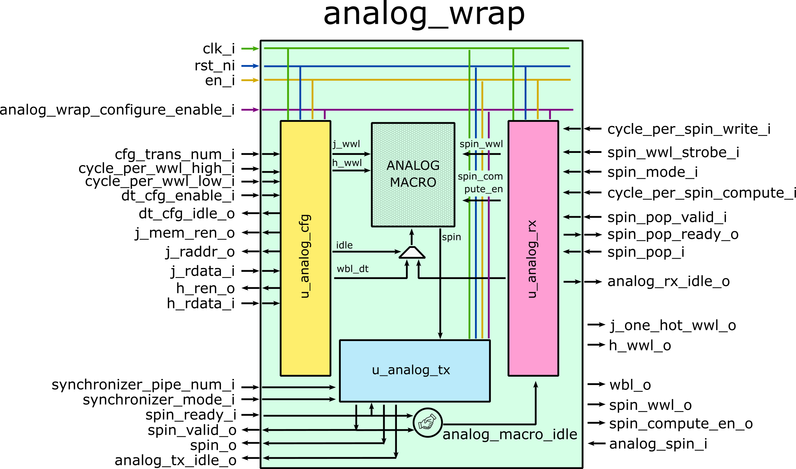

# Analog Macro Wrap

## Description

This module serves as a dedicated wrapper for the analog macro. It has the following submodules:

- u_nalog_cfg: fetches data from memory (J) and registers (h) and convert them into WWL/WBL format.

- u_analog_rx: receives spin input from upstream and convert it into WWL/WBL format.

- u_analog_tx: synchronizes spin data from *analog_spin_i* and convert the data into valid/ready protocol.

The module overview is provided in the picture below.

**Note**: in the picture, the analog macro is outside the module rather than within the module.

The module supports following operations:

**J/h Onloading**: the data is continuously read in through *j_rdata_i* and *h_rdata_i*. Then it outputs to *j_one_hot_wwl_o*, *h_wwl_o* and *wbl_o*. In this operation, only u_analog_cfg works.

**Computation**: the spin enters from digital domain through u_analog_rx and outputs to digital domain through u_analog_tx. u_analog_cfg does not work in this operation.

## Performance

The performance is different for different operations.

**J/h Onloading**: once the onloading starts, the *j_mem_ren_o* is asserted next cycle and the WWL/WBL will be asserted from the 3rd cycle. WWL remains high for *cycle_per_wwl_high_i* cycles and then switches to low for *cycle_per_wwl_low_i* cycles before starting to assert next WWL signal.

**Computation**: once u_analog_rx receives the spin, the *spin_wwl_o* and *wbl_o* are asserted from the next cycle and remains for *cycle_per_spin_write_i* cycles. At the same time, another counter is activated until it reaches *cycle_per_spin_compute_i*, followed by the synchronization in u_analog_tx.

## Module Parameters

*NUM_SPIN:* [int] the number of spins  (default: 256)

*BITDATA*: [int] bitwise precision of onloading data (J and h) (default: 4)

*PARALLELISM*: [int] parallelism of J data in the memory (default: 4)

*COUNTER_BITWIDTH*: [int] bitwidth of all counters within the module (default: 16)

*SYNCHRONIZER_PIPEDEPTH*: [int] maximal synchronizer depth (default: 3)

## Runtime Configurable Parameters

*cfg_trans_num_i*: [COUNTER_BITWIDTH-1:0] targeted number of onloading transactions during data onloading (default: the maximal value).

*cycle_per_wwl_high_i*: [COUNTER_BITWIDTH-1:0] cycle number of WWL remaining high during data onloading (default: the maximal value).

*cycle_per_wwl_low_i*: [COUNTER_BITWIDTH-1:0] cycle number of WWL remaining low during data onloading (default: the maximal value).

*cycle_per_spin_write_i*: [COUNTER_BITWIDTH-1:0] cycle number of spin WWL remaining high during data onloading (default: the maximal value).

*cycle_per_spin_compute_i*: [COUNTER_BITWIDTH-1:0] cycle number before synchronization happens (default: the maximal value).

*spin_wwl_strobe_i*: [NUM_SPIN-1:0] the spin WWL strobe. For every spin onloading, spin WWL is set as *spin_wwl_strobe*.

*spin_mode_i*: [NUM_SPIN-1:0] the spin mode input of the analog macro.

*synchronizer_pipe_num_i*: [$clog2(SYNCHRONIZER_PIPEDEPTH)-1:0] selected synchronizer depth (default: the maximal value).

*synchronizer_mode_i*: synchronizer mode. If 1, synchronizer works continuously. If 0, it works only when an internal counter reaches *cycle_per_spin_compute_i* (default: 0).

## Module Interface

*clk_i:* clock input

*rst_ni:* active-low reset input

*en_i:* active-high module enable signal

*analog_wrap_configure_enable_i*: config enable signal.

*cfg_trans_num_i*: [COUNTER_BITWIDTH-1:0] targeted number of onloading transactions during data onloading.

*cycle_per_wwl_high_i*: [COUNTER_BITWIDTH-1:0] cycle number of WWL remaining high during data onloading.

*cycle_per_wwl_low_i*: [COUNTER_BITWIDTH-1:0] cycle number of WWL remaining low during data onloading.

*cycle_per_spin_write_i*: [COUNTER_BITWIDTH-1:0] cycle number of spin WWL remaining high during data onloading.

*cycle_per_spin_compute_i*: [COUNTER_BITWIDTH-1:0] cycle number before synchronization happens.

*spin_wwl_strobe_i*: [NUM_SPIN-1:0] the spin WWL strobe. For every spin onloading, spin WWL is set as *spin_wwl_strobe*.

*spin_mode_i*: [NUM_SPIN-1:0] the spin mode input of the analog macro.

*synchronizer_pipe_num_i*: [$clog2(SYNCHRONIZER_PIPEDEPTH)-1:0] selected synchronizer depth.

*synchronizer_mode_i*: synchronizer mode. If 1, synchronizer works continuously. If 0, it works only when an internal counter reaches *cycle_per_spin_compute_i*.

*dt_cfg_enable_i*: enable signal of starting data onloading.

*j_mem_ren_o*: J memory read enable signal.

*j_raddr_o*: [J_ADDRESS_WIDTH-1:0] J memory read address.

*j_rdata_i*: [NUM_SPIN*BITDATA*PARALLELISM-1:0] returned data from J memory.

*h_ren_o*: h register read enable signal.

*h_rdata_i*: [NUM_SPIN*BITDATA-1:0] returned h data.

*j_one_hot_wwl_o*: [NUM_SPIN-1:0] WWL output to analog macro during data onloading.

*h_wwl_o*: WWL for h address.

*wbl_o*: [NUM_SPIN*BITDATA-1:0] WBL to analog macro.

*wblb_o*: [NUM_SPIN*BITDATA-1:0] WBLB to analog macro.

*spin_pop_valid_i*: spin valid signal from upstream.

*spin_pop_ready_o*: spin ready signal to upstream.

*spin_pop_i*: spin data.

*spin_wwl_o*: [NUM_SPIN-1:0] spin WWL to analog macro.

*spin_compute_en_o*: [NUM_SPIN-1:0] spin mode to analog macro. The value is set by *spin_mode_i*.

*spin_i*: [NUM_SPIN-1:0] returned spin value from analog macro.

*spin_valid_o*: spin valid signal to downstream.

*spin_ready_i*: spin ready signal from downstream.

*spin_o*: [NUM_SPIN-1:0] spin value to downstream.

*dt_cfg_idle_o*: status (idle or not) of submodule u_analog_cfg.

*analog_rx_idle_o*: status (idle or not) of submodule u_analog_rx.

*analog_tx_idle_o*: status (idle or not) of submodule u_analog_tx.

