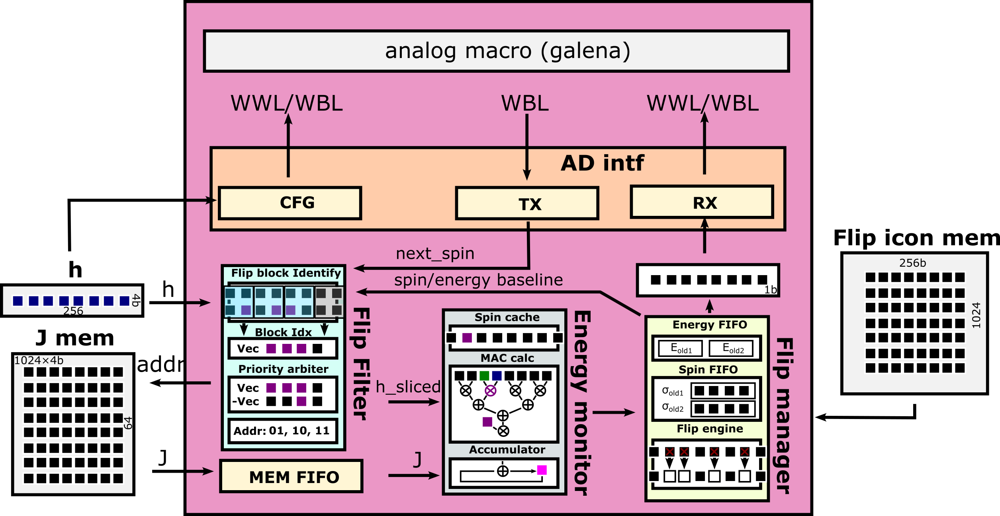

# Digital Macro

## Description

This module is the top module of the digital logic for a single Ising core.

Depending on whether the parameter *ENABLE_FLIP_DETECTION* is set to 0 or 1, there are two version of the architecture overview.

When *ENABLE_FLIP_DETECTION* is 0, the module overview is provided in the picture below.

When *ENABLE_FLIP_DETECTION* is 1, the module overview is provided in the picture below.

**Note**: the module assumes all peripheral memories exactly take 1 clock cycle to return data.

## Performance

The module supports generally two different modes (only the regular mode is supported when *ENABLE_FLIP_DETECTION* is 0):

- **Regular mode**: the digital logic does the energy calculation step by step. For a 256-spin problem with 4-parallel adders, it takes ~66 cycles (256/4+1 pipeline in adder + 1 for applying flipping).

- **Smarter mode**: this mode is for when there is not much change in the spin state. The exact delay depends on the targeted problems and data. If there is no change in spin states, it takes {4+PIPESFLIPFILTER} cycles per iteration. If there is changes in spin states, it takes {9+PIPESFLIPFILTER+#Address} cycles per iteration, where #Address means the number of requested addresses to J memory. Please note that this cycle cost can be overlapped due to the pipeline when SPIN_DEPTH > 1, and the average cycle cost per iteration can be smaller (here is the inclusive upper bound). Tested using the data under the folder [./data](../../unit_tests/digital_macro/data/), the average cycle delay per energy calculation is 17 cycles. Please note that if there is always big change in the spin state, switching to this mode can be ~4 cycles slower than the regular mode.

## Module Parameters

*BITJ*: [int] bit precision of each signed weight (default: 4).

*BITH*: [int] bit precision of each signed bias (default: 4).

*NUM_SPIN*: [int] the number of spins, must be multiple of PARALLELISM  (default: 256).

*SCALING_BIT*: [int] bit precision of the $h_{sfc}$ (default: 5).

*PARALLELISM*: [int] parallelism of partial energy calculators (default: 4).

*LOCAL_ENERGY_BIT*: [int] bit precision of local energy, defined as $\sum_{j} w_{ij} \sigma_i \sigma_j + h_{sfc} \cdot h_i \sigma_i$ (default: 16).

*ENERGY_TOTAL_BIT*: [int] bit precision of total energy output (i.e. $H$) (default: 32).

*LITTLE_ENDIAN*: [int] whether the spin vector and bias vector follows little-endian format or not. Whatever endianness J vector follows does not matter as long as it matches with the spin vector.

*PIPESINTF*: [int] the pipeline depth at the module input interface of the energy monitor (default: 1).

*PIPESMID*: [int] the pipeline depth in the adder trees within the energy monitor module (default: 1).

*PIPESFLIPFILTER*: [int] the pipeline depth at the module input interface of the flip filter (default: 1).

*SPIN_DEPTH*: [int] depth (entries) of internal spin/energy FIFOs (default: 2, min: 1).

*FLIP_ICON_DEPTH*: [int] number of entries in the flip icon memory (default: 1024).

*COUNTER_BITWIDTH*: [int] counter bit width (default: 16).

*SYNCHRONIZER_PIPEDEPTH*: [int] maximal synchronizer depth (default: 3).

*SPIN_WBL_OFFSET*: [int] since WBL is used by both data onloading operation and spin onloading operation. This parameter defines which bit in WBL is used for spin onloading for every *BITDATA* bits. (default: 0).

*H_IS_NEGATIVE*: [int] whether H=-0.5*J*spin-h*spin, or H = 0.5*J*spin+h*spin (default: 1).

*ENABLE_FLIP_DETECTION*: [int] whether to implement the version supporting flip detection. If false, the flip filter module will not be generated.

## Module Interface

#### Global interface

*clk_i*: clock input

*rst_ni*: active-low reset input

*en_aw_i*: active-high enable signal for the analog wrap module.

*en_em_i*: active-high enable signal for the energy monitor module.

*en_fm_i*: active-high enable signal for the flip manager module.

*en_ff_i*: active-high enable signal for the flip filter module.

*en_ef_i*: active-high enable signal for the memory fifo module.

*en_perf_counter_i*: performance counter enable signal.

*en_analog_loop_i*: active-high enable signal for whether involving analog wrap module into the datapath loop. If low, the flip manager will send output directly to the energy monitor.

*en_comparison_i*: whether or not to enable energy comparison in u_energy_fifo_maintainer. If 0, new energy value and spin value are always updated into energy FIFO and spin FIFO.

*flip_disable_i*: whether to disable spin flipping.

*enable_flip_detection_i*: whether to enable the flip detection feature.

*dgt_addr_upper_bound_i*: [$clog2(NUM_SPIN / PARALLELISM)-1:0] the upper bound (inclusive) of the J memory address. For 256-spin case with 4-parallel J rows per address, the upper bound is 256/4=64.

*cmpt_en_i*: whether to start to rise *spin_pop_valid_i* from next cycle.

*cmpt_idle_o*: whether the module is idle.

*host_readout_i*: whether to start spin FIFO reading-out process.

#### Configuration interface

*config_valid_em_i*: active-high enable signal for configuring the energy monitor.

*config_valid_fm_i*: active-high enable signal for configuring the flip manager.

*config_valid_aw_i*: active-high enable signal for configuring the analog wrap module.

*config_counter_i*: [$clog(NUM_SPIN)-1:0] upper bound of the counter for the energy monitor.

*config_spin_initial_i*: [NUM_SPIN-1:0] spin states to load into the spin FIFO of the flip manager module.

*config_spin_initial_skip_i*: whether to skip the current configuration of the spin FIFO. For example, suppose the spin FIFO depth is two and you want to configure the second spin state in the spin FIFO and keep the first one as it was, you can rise *config_spin_initial_skip_i* for one cycle, then the configuration pointer in the flip manager will be moved to the second spin state.

*cfg_trans_num_i*: [COUNTER_BITWIDTH-1:0] targeted number of onloading transactions during data onloading.

*cycle_per_wwl_high_i*: [COUNTER_BITWIDTH-1:0] cycle number of WWL remaining high during data onloading.

*cycle_per_wwl_low_i*: [COUNTER_BITWIDTH-1:0] cycle number of WWL remaining low during data onloading.

*cycle_per_spin_write_i*: [COUNTER_BITWIDTH-1:0] cycle number of spin WWL remaining high during data onloading.

*cycle_per_spin_compute_i*: [COUNTER_BITWIDTH-1:0] cycle number before synchronization happens.

*bypass_data_conversion_i*: whether to bypass the specific analog data conversion when onloading J and h to the analog wbl_o.

*spin_wwl_strobe_i*: [NUM_SPIN-1:0] the spin WWL strobe. For every spin onloading, spin WWL is set as *spin_wwl_strobe*.

*spin_feedback_i*: [NUM_SPIN-1:0] the spin feedback configuration of the analog macro.

*synchronizer_pipe_num_i*: [$clog2(SYNCHRONIZER_PIPEDEPTH)-1:0] selected synchronizer depth.

*wbl_floating_i*: control signal for the analog wbl floating signal. Directly connected to *wbl_floating_o*.

*dt_cfg_enable_i*: enable signal of starting data onloading to the analog macro.

*cmpt_max_num_i*: maximal high-level loop number under the multi-cmpt mode.