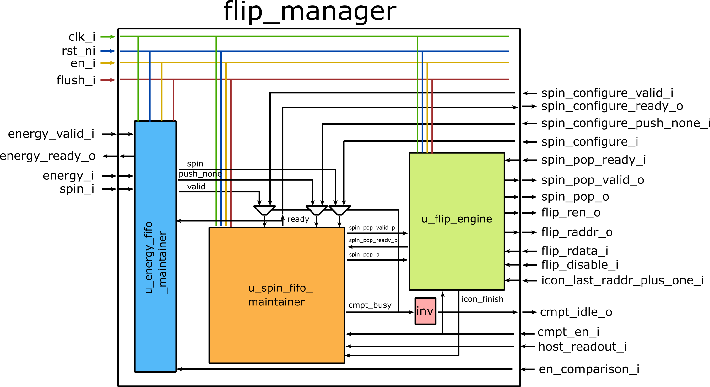

# Flip Manager

## Description

This module maintains the flipping operation for each trail. It has the following submodules:

- u_spin_fifo_maintainer has a spin register file, where the initial spin states are set and new spin states are updated. The depth of the register file is a design-time parameter.
- u_flip_engine manages the interface to the flip icon interface and the spin pop interface. It takes spin input from u_spin_fifo_maintainer, flip spins if flip icon is applied, and send the flipped spins to spin pop.
- u_energy_fifo_maintainer has an energy register file, whose depth is the same as the spin fifo. It receives a spin input and its energy value, compare the energy value with the saved value, check if the energy value is lower, and send the comparison result and spin to u_spin_fifo_maintainer.

The module overview is provided in the picture below.

The module has the following behaviors:

**During onloading**: the spin states in the spin register file must be configured by *spin_configure_i*, until spin register file is full. The spin register file behaves as a FIFO (namely spin FIFO afterwards).

**During computation**:

- S1: Computation starts by setting *cmpt_en_i* as 1. This signal is internally routely to u_spin_fifo_maintainer.
- S2: At the next cycle, the *cmpt_idle_o* switches to 0. At the same time, u_spin_fifo_maintainer rises the valid flag.
- S3: At the same cycle seeing the valid flag, the *flip_ren_o* is asserted.
- S4: One cycle later, the *spin_pop_valid_o* rises, when receiving the flip icon. The flip address pointer in u_flip_engine moves to the next one.
- S5: After a handshake between *spin_pop_valid_o* and *spin_pop_ready_i*, the spin is sent downstream by *spin_pop_o*. The read pointer in u_spin_fifo_maintainer move to the next address.
- S6: The u_energy_fifo_maintainer independently receives new spin input and energy value from upstream. The energy comparison is done at the input interface. If new energy value is lower than the one saved in the energy FIFO, the old energy value is replaced with the new one. Write pointer of the energy FIFO moves to the next address. At the next cycle, the valid flag is asserted and waits for handshake with u_spin_fifo_maintainer.
- S7: Once a handshake happens between u_energy_fifo_maintainer and u_spin_fifo_maintainer, the read pointer of the energy FIFO moves to the next address.
- S8: At the next cycle, the new spin is written into the spin FIFO or discarded based on the energy comparison result. The write pointer of the spin FIFO moves to the next address. The valid flag is asserted and sent to u_flip_engine.
- S9: Repeat S2-S8, until the flip address pointer in u_flip_engine equals *icon_last_addr_puls_one_i*. Then, *spin_pop_valid_o* is forced to be 0.
- S10: Repeat S6-S8 until spin FIFO is full. Then *cmpt_idle_o* is set to 1.

**Note**: the module assumes the flip memory exactly takes 1 clock cycle.

## Performance

Starting from energy handshake, it takes 3 cycles to output a new spin vector.

## Module Parameters

*NUM_SPIN:* [int] the number of spins  (default: 256)

*SPIN_DEPTH:* [int] depth (entries) of internal spin/energy FIFOs

*ENERGY_TOTAL_BIT:* [int] bit precision of total energy output (i.e. $H$) (default: 32)

*FLIP_ICON_DEPTH:* [int] number of entries in the flip icon memory

## Runtime Configurable Parameters

*spin_configure_i*: [NUM_SPIN-1:0] spin value configuration in spin FIFO. Handshake is supported.

*spin_configure_push_none_i*: if skip the current spin value configuration. If 1, no value is written into the spin FIFO and its read pointer moves to the next address.

*flush_i*: whether or not to flush all saved values in spin FIFO and reload spin values.

*en_comparison_i*: whether or not to enable energy comparison in u_energy_fifo_maintainer. If 0, new energy value and spin value are always updated into energy FIFO and spin FIFO.

*icon_last_raddr_plus_one_i*: [FLIP_ICON_ADDR_DEPTH+1-1:0] the address to judge when to disable *spin_pop_valid_o*.

*flip_disable_i*: whether or not to disable spin flipping in u_spin_engine. If 1, flip icon is not applied. Note this will not save latency, as u_flip_engine naturely has one pipeline within.

## Module Interface

*clk_i:* clock input

*rst_ni:* active-low reset input

*en_i:* active-high module enable signal

*flush_i*: whether or not to flush all saved values in spin FIFO and reload spin values.

*en_comparison_i*: whether or not to enable energy comparison in u_energy_fifo_maintainer.

*cmpt_en_i*: whether to start to rise *spin_pop_valid_i* from next cycle.

*cmpt_idle_o*: whether the module is idle.

*host_readout_i*: whether to start spin FIFO reading-out process.

*spin_configure_valid_i*: configuration valid signal.

*spin_configure_i*: [NUM_SPIN-1:0] spin configuration.

*spin_configure_push_none_i*: whether to skip current spin configuration.

*spin_configure_ready_o*: configuration ready signal.

*spin_pop_valid_o*: valid signal for downstream.

*spin_pop_o*: [NUM_SPIN-1:0] spin output to downstream.

*spin_pop_ready_i*: ready signal from downstream.

*energy_valid_i*: energy valid signal from upstream.

*energy_ready_o*: energy ready signal to upstream.

*energy_i*: [ENERGY_TOTAL_BIT-1:0] received energy value from upstream.

*spin_i*: [NUM_SPIN-1:0] received spin value from upstream.

*flip_ren_o*: enable signal to flip icon memory.

*flip_raddr_o*: [FLIP_ICON_ADDR_DEPTH+1-1:0] read address signal to flip icon memory.

*icon_last_raddr_plus_one_i*: [FLIP_ICON_ADDR_DEPTH+1-1:0] targeted uplimit for *flip_raddr_o*.

*flip_rdata_i*: [NUM_SPIN-1:0] received flip icon from flip icon memory.

*flip_disable_i*: whether to disable spin flipping.
